## Spiderfoot Install
Navigate to https://github.com/smicallef/spiderfoot and you will see all the different details and structure of Spiderfoot. You can install it from source or use Docker. For this tutorial we will install from source.
```
git clone https://github.com/smicallef/spiderfoot
cd spiderfoot
```
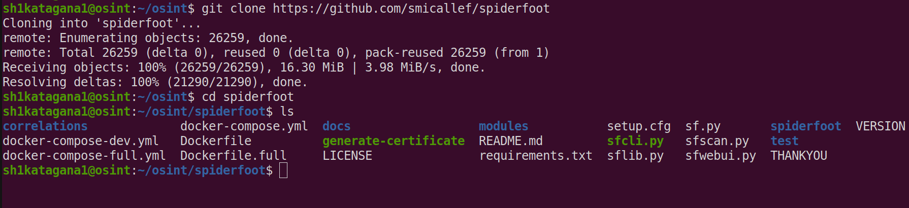

Create a Python virtual environment
```
python3 -m venv venv
```
Activate it
```
source venv/bin/activate
```
There are a couple issues with the requirements.txt that we need to fix:
```
nano requirements.txt
```
Find the line 
```
lxml>=4.9.2,<5
```
And make it
```
lxml
```
Next find the line:
```
pyyaml>=6.0.0,<7
```
And make it 
```
pyyaml
```
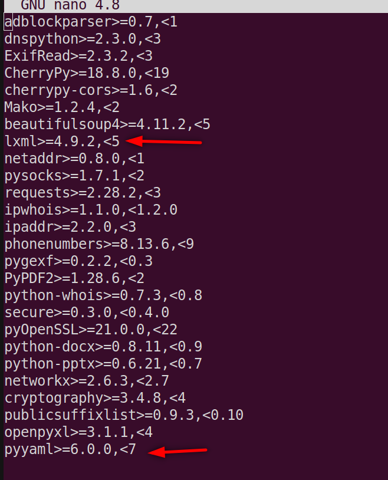

Now run:
```
pip3 install -r requirements.txt
```
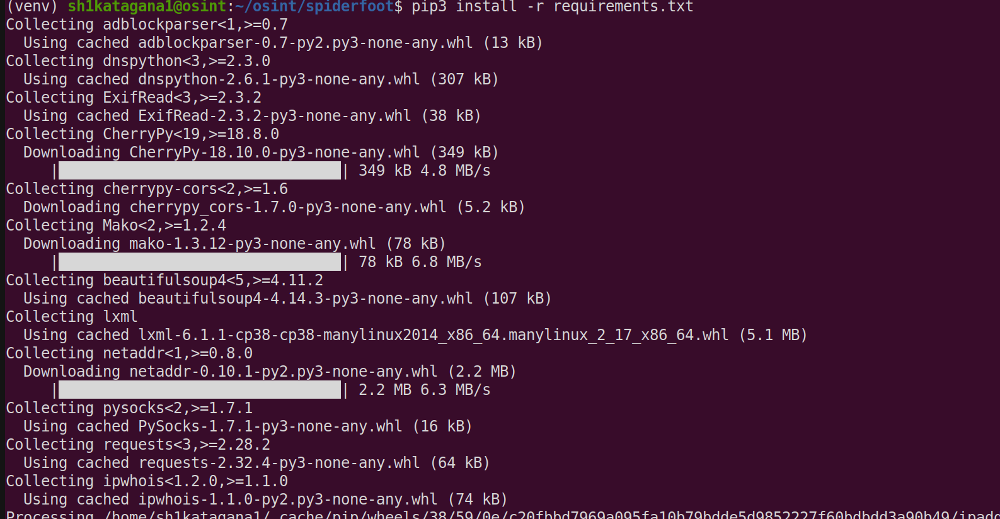

Let's test that its working:
```
python3 sf.py -h
```
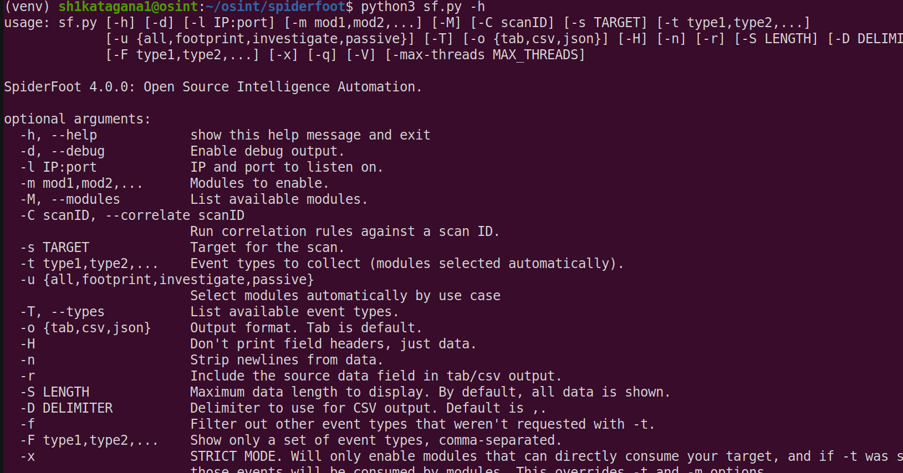

There are a couple of ways to run it, one via command line and one via a Web GUI. For this tutorial we will use the UI.
```
python3 sf.py -l 127.0.0.1:5001
```
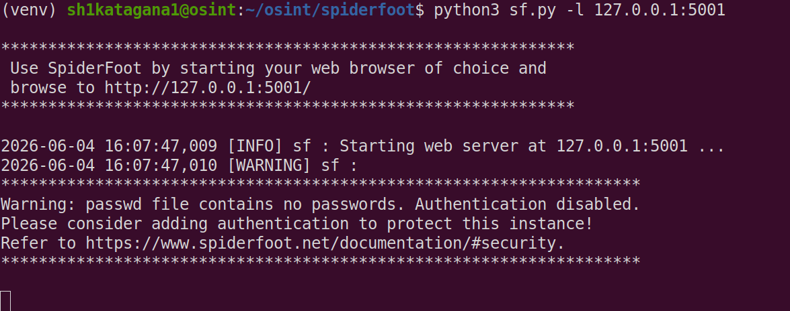

You should see it start this up without error. Now open up a browser and browse to 127.0.0.1:5001 and you should get a UI:

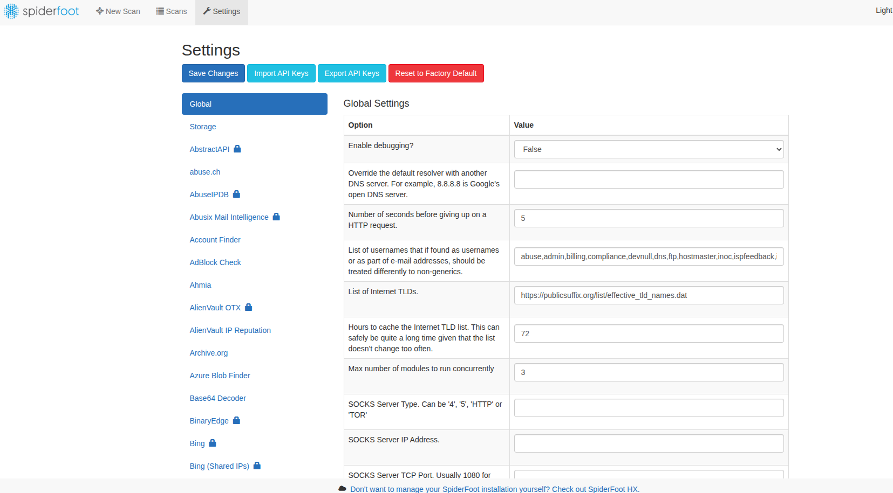

From the Settings page you can set global settings and also set API keys and settings for the different modules. As an example:
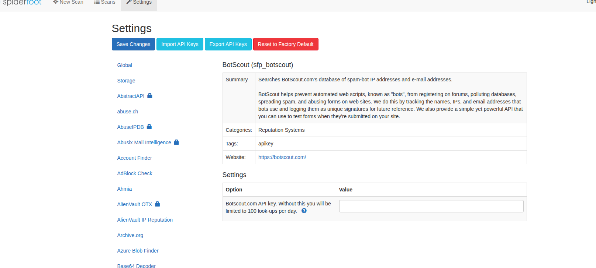

There you will see where you enter in your API Key for BotScout. 

## Spiderfoot Concepts
To understand what all these modules do, you first have to understand how Spiderfoot does its conceptual design. At a high level, SpiderFoot Open Source is essentially a modular OSINT automation framework. Understanding it becomes much easier if you think of it as a pipeline:
```
Target → Events → Modules → Database → UI
```
When you scan a target, SpiderFoot creates events (pieces of intelligence), passes them between modules, stores everything in SQLite, and displays the results in the web interface.

## Core Components
### sf.py
This is the main entry point. When you launch SpiderFoot, python3 sf.py:
1. Starts the web interface
2. Loads configuration
3. Initializes the database
4. Loads all modules
5. Starts scan management

### sfscan.py
This is the scan engine. The scan engine:
1. Creates a scan record
2. Loads enabled modules
3. Creates the first event
4. Starts processing

### The Event System
Everything revolves around events. For example, if you scan example.com, Spiderfoot creates something like:
```
SpiderFootEvent(
    "DOMAIN_NAME",
    "example.com",
    module
)
```
Modules subscribe to event types. To make it more clear, lets do an example. In the UI, go to New Scan and name it example dns. Then for the Scan Target do example.com.

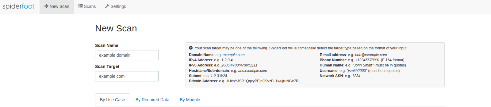

Then you see different tabs, go to By Module. Click Deslect All and find in the list the module for DNS Resolver and check it. 

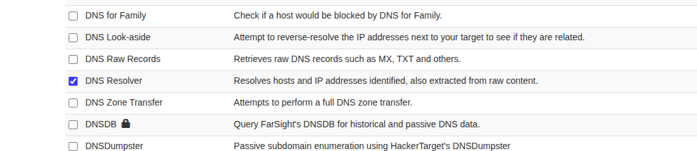

Scroll to the bottom and click Scan Now. When its done you should see something like:

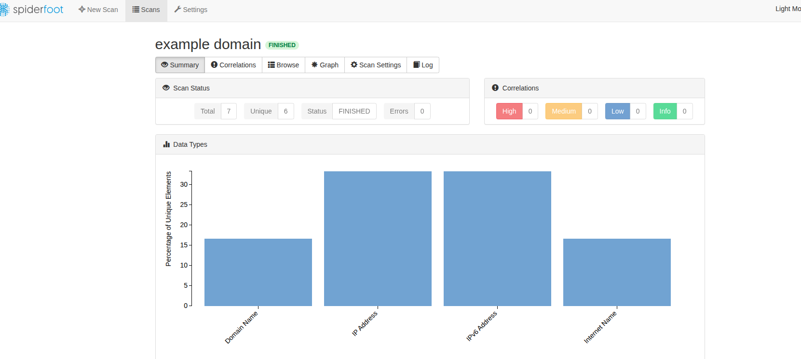

Click Browse and see the results it gave back.

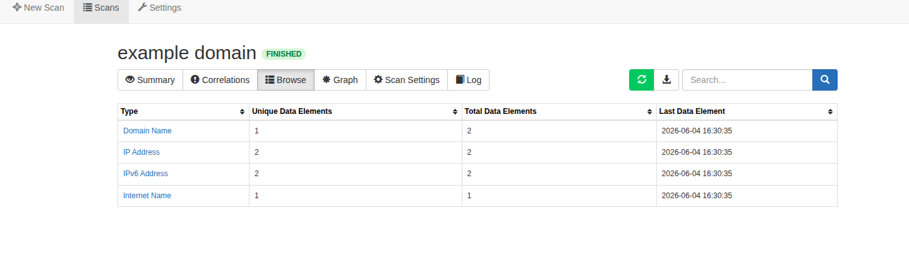

Click Domain Name and you will see 2 modules found that domain name, the Spiderfoot Internal one and the sfp_dnsresolve one. 

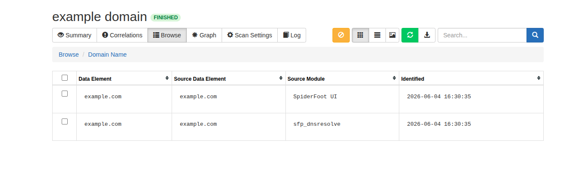

Go back and click on the IP Address one and see it resolved the 2 IPs based on DNS records. Keep in mind we only chose one module, the DNS Resolver one. Let's look at the module script for this one and see whats going on. To find it, go to Spiderfoot/modules folder and open up sfp_dnsresolve.py. 

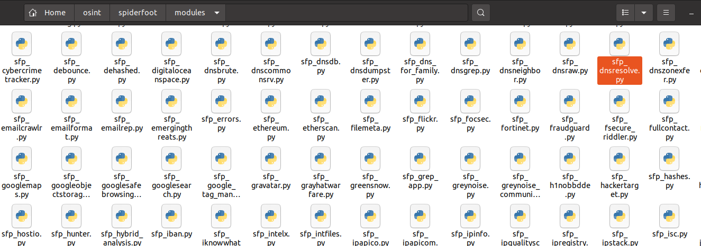

Scroll down until you find:
```
def watchedEvents(self):
def producedEvents(self):
```

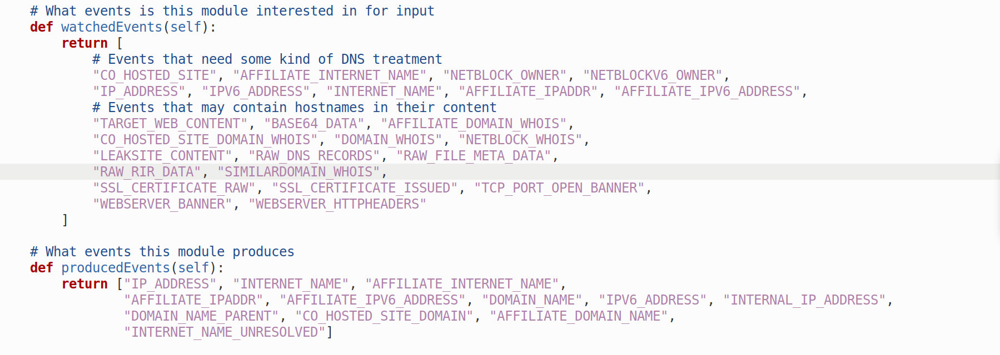

```
    def watchedEvents(self):
        return [
            # Events that need some kind of DNS treatment
            "CO_HOSTED_SITE", "AFFILIATE_INTERNET_NAME", "NETBLOCK_OWNER", "NETBLOCKV6_OWNER",
            "IP_ADDRESS", "IPV6_ADDRESS", "INTERNET_NAME", "AFFILIATE_IPADDR", "AFFILIATE_IPV6_ADDRESS",
            # Events that may contain hostnames in their content
            "TARGET_WEB_CONTENT", "BASE64_DATA", "AFFILIATE_DOMAIN_WHOIS",
            "CO_HOSTED_SITE_DOMAIN_WHOIS", "DOMAIN_WHOIS", "NETBLOCK_WHOIS",
            "LEAKSITE_CONTENT", "RAW_DNS_RECORDS", "RAW_FILE_META_DATA",
            "RAW_RIR_DATA", "SIMILARDOMAIN_WHOIS",
            "SSL_CERTIFICATE_RAW", "SSL_CERTIFICATE_ISSUED", "TCP_PORT_OPEN_BANNER",
            "WEBSERVER_BANNER", "WEBSERVER_HTTPHEADERS"
        ]

    # What events this module produces
    def producedEvents(self):
        return ["IP_ADDRESS", "INTERNET_NAME", "AFFILIATE_INTERNET_NAME",
                "AFFILIATE_IPADDR", "AFFILIATE_IPV6_ADDRESS", "DOMAIN_NAME", "IPV6_ADDRESS", "INTERNAL_IP_ADDRESS",
                "DOMAIN_NAME_PARENT", "CO_HOSTED_SITE_DOMAIN", "AFFILIATE_DOMAIN_NAME",
                "INTERNET_NAME_UNRESOLVED"]
```
These are the crux of how Spiderfoot works. 
1. The watchedEvents is saying "This module is looking for anytime one of the below entities pop up in Spiderfoot" I'll explain better in a minute.
2. The producedEvents is what this module can produce for entities

Let's break that down further. If another modules produceEvents(self) function produces an IP address, like maybe Shodan module discovers an IP address, Then this dnsresolve module is waiting to see that. When it does see IP_ADDRESS, it fires off and does it's thing to enrich that. In that example, you can say that your scan target is example.com, and you select both modules DNS Resolver and Shodan. Dnsresolve runs and produces an IP_ADDRESS entity. This entity is now on the table and any modules (Shodan) that are listening (watching) for an entity of IP_ADDRESS, they fire off and enrich the IP Address, maybe the GEO Location of it.

If you look at Shodans script:
```
 # What events is this module interested in for input
    def watchedEvents(self):
        return ["IP_ADDRESS", "NETBLOCK_OWNER", "DOMAIN_NAME", "WEB_ANALYTICS_ID"]

    # What events this module produces
    def producedEvents(self):
        return ["OPERATING_SYSTEM", "DEVICE_TYPE",
                "TCP_PORT_OPEN", "TCP_PORT_OPEN_BANNER",
                'RAW_RIR_DATA', 'GEOINFO', 'IP_ADDRESS',
                'VULNERABILITY_CVE_CRITICAL',
                'VULNERABILITY_CVE_HIGH', 'VULNERABILITY_CVE_MEDIUM',
                'VULNERABILITY_CVE_LOW', 'VULNERABILITY_GENERAL']
```

We can see that it does watch for anytime an IP_ADDRESS shows up. We know from the dnsresolve script:
```
 def producedEvents(self):
        return ["IP_ADDRESS"
```
That when it runs, one thing it can give back as a result is an IP Address. Therefore, when both modules are active for a scan, dnsresolve will parse the domain name example.com and one of its results is an IP Address. This now would get passed to Shodan and get that bad boy running and maybe find the GEOINFO for it, as we can see in its producedEvents, one of them is GEOINFO:
```
def producedEvents(self):
        return ["OPERATING_SYSTEM", "DEVICE_TYPE",
                "TCP_PORT_OPEN", "TCP_PORT_OPEN_BANNER",
                'RAW_RIR_DATA', 'GEOINFO', 'IP_ADDRESS',
                'VULNERABILITY_CVE_CRITICAL',
                'VULNERABILITY_CVE_HIGH', 'VULNERABILITY_CVE_MEDIUM',
                'VULNERABILITY_CVE_LOW', 'VULNERABILITY_GENERAL']
```
Now if you add in something like the IPInfo module, you may get more enrichment of the IP address. Let's see it live. I made a new scan where the Scan Target was example.com, and I activated the modules, DNS Resolve, Shodan and IPInfo. 

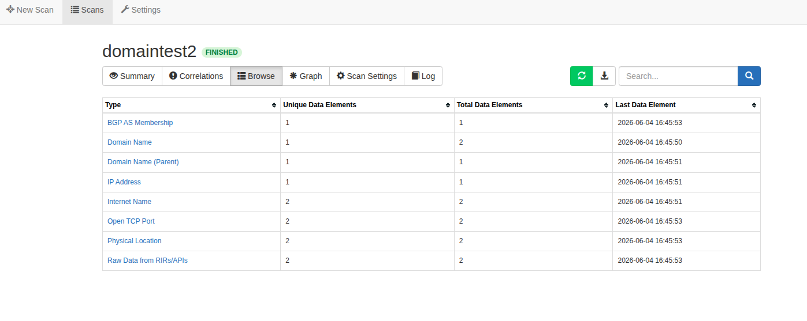

You can see one of the results is Physical Location, let's take a look.

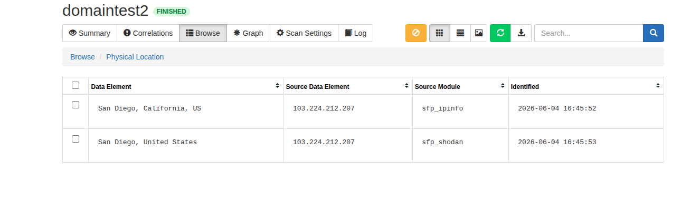

Note how both Shodan and IPInfo both gave the GEO Info. You can see how this can "Spider" out quite extensively depending on what modules you enable. 

So in summary, watchedEvents are ones that the module will sit there in a waiting state until it sees an Entity produced that is in its watch list. If it sees one, it then runs and enrichs and then it has producedEvents. Out of the list producedEvents, there may be 3 or 4 entities that 4 other modules are watching for, which means they will now kick off, enrich and make their own producedEvents. 

Then you have handleEvent(). This is where the work happens, SpiderFoot calls this whenever a watched event arrives.
```
def handleEvent(self, event):
```
Let's say you have:
```
EMAILADDR
```
Module queries EmailRep API and returns an EMAILADDR_COMPROMISED event.


## SpiderFootPlugin Base Class
Almost every module inherits from:
```
SpiderFootPlugin
```
This provides helper functions.

### notifyListeners()
This creates a new event
```
evt = SpiderFootEvent(
    "EMAILADDR",
    email,
    self.__name__,
    parentEvent
)

self.notifyListeners(evt)
```
This tells SpiderFoot "New event found!"

### checkForStop()
Allows graceful scan stopping.
```
if self.checkForStop():
    return
```

### error()
Log an error.
```
self.error("API failed")
```

### debug()
Debug logging.
```
self.debug("Response received")
```

## Database Layer
This is usually found at spiderfoot/spiderfoot/db.py and it is using SQLite. It's main purpose is to store:
1. Scans
2. Events
3. Results
4. Module data

Some important tables are:

### tbl_scan_instance
One row per scan. It contains:
1. Scan ID
2. Target
3. Status
4. Start Time

### tbl_scan_results
This is the important one. It stores:
1. Event Type
2. Event Data
3. Source Module

Example:
```
EMAILADDR
john@example.com
sfp_emailrep
```

### tbl_scan_log
Stores logs. Example:
```
INFO
ERROR
DEBUG
```

## Event Storage Flow
```
Module
   |
   v
notifyListeners()
   |
   v
Database
   |
   v
Other Modules
```

SpiderFoot stores the event before distributing it. This is why you can later see complete scan history.

## db.py
This file handles database operations. Functions include:
1. scanInstanceCreate()
2. scanResultStore()
3. scanLogEvent()
4. scanInstanceGet()

When you modify db.py for EmailRep, you are extending what event types can be stored and displayed properly. There may be some event types produced by a module that are not included by default in Spiderfoot, this file is where you can create new event types to be used by Spiderfoot. 

## The Web UI
The UI doesn't perform OSINT. It simply reads from the database. When you click Scan Results, the UI queries SQLite.
```
Flow:

Module
   |
   v
Database
   |
   v
Web UI
```

## The Module Loader
SpiderFoot loads modules from:
```
modules/
```
Examples:
```
sfp_dnsresolve.py
sfp_emailrep.py
sfp_hunter.py
sfp_hibp.py
```
Each module is dynamically imported. SpiderFoot builds a map:
```
Event Type -> Interested Modules
```
This is how event routing works efficiently. Let's use Emailrep as an example of this flow: 
1. SpiderFoot discovers: john@example.com and creates: EMAILADDR
2. Emailrep module receives it because EMAILADDR is in its watchedEvents()
3. The Module calls the API, which returns:
```
{
  "suspicious": true,
  "references": 14,
  "reputation": "high"
}
```
Module creates events:
```
EMAILREP_SUSPICIOUS
EMAILREP_REPUTATION
EMAILREP_REFERENCES
```
4. Then, notifyListeners() fires off, notifying all other activated modules of these created events, in case any of them have them in their watchedEvents list. 
5. Suppose you have some Risk Scoring Module, it ingests EMAILREP_SUSPICIOUS and creates MALICIOUS_INDICATOR.

Now, you dont want to go crazy with the amount of Events, because some APIs give back a ton of JSON fields. Let's say the Emailrep API returns this:
```
{
  "reputation": "high",
  "suspicious": false,
  "references": 10,
  "details": {
    "credentials_leaked": true,
    "data_breach": true,
    "disposable": false,
    "spoofable": true,
    "profiles": ["twitter"]
  }
}
```

You could essentially create your producedEvents like this:
```
def producedEvents(self):
    return [
        "EMAILADDR_REPUTATION",
        "EMAILADDR_CREDENTIALS_LEAKED",
        "EMAILADDR_DATA_BREACH",
        "EMAILADDR_DISPOSABLE",
        "EMAILADDR_SPOOFABLE",
        "SOCIAL_MEDIA"
    ]
```
Then in handleEvents()
```
if details.get("credentials_leaked"):
    evt = SpiderFootEvent(
        "EMAILADDR_CREDENTIALS_LEAKED",
        email,
        self.__name__,
        parentEvent
    )
    self.notifyListeners(evt)
```
Of course, if these Event Types are not already in db.py, you would need to make them. A short snippet of the area in db.py is:
```
eventDetails = [
        ['ROOT', 'Internal SpiderFoot Root event', 1, 'INTERNAL'],
        ['ACCOUNT_EXTERNAL_OWNED', 'Account on External Site', 0, 'ENTITY'],
        ['ACCOUNT_EXTERNAL_OWNED_COMPROMISED', 'Hacked Account on External Site', 0, 'DESCRIPTOR'],
        ['ACCOUNT_EXTERNAL_USER_SHARED_COMPROMISED', 'Hacked User Account on External Site', 0, 'DESCRIPTOR'],
        ['AFFILIATE_EMAILADDR', 'Affiliate - Email Address', 0, 'ENTITY'],
        ['AFFILIATE_INTERNET_NAME', 'Affiliate - Internet Name', 0, 'ENTITY'],
        ['AFFILIATE_INTERNET_NAME_HIJACKABLE', 'Affiliate - Internet Name Hijackable', 0, 'ENTITY'],
        ['AFFILIATE_INTERNET_NAME_UNRESOLVED', 'Affiliate - Internet Name - Unresolved', 0, 'ENTITY'],
        ['AFFILIATE_IPADDR', 'Affiliate - IP Address', 0, 'ENTITY'],
        ['AFFILIATE_IPV6_ADDRESS', 'Affiliate - IPv6 Address', 0, 'ENTITY'],
        ['AFFILIATE_WEB_CONTENT', 'Affiliate - Web Content', 1, 'DATA'],
        ['AFFILIATE_DOMAIN_NAME', 'Affiliate - Domain Name', 0, 'ENTITY'],
        ['AFFILIATE_DOMAIN_UNREGISTERED', 'Affiliate - Domain Name Unregistered', 0, 'ENTITY'],
        ['AFFILIATE_COMPANY_NAME', 'Affiliate - Company Name', 0, 'ENTITY'],
        ['AFFILIATE_DOMAIN_WHOIS', 'Affiliate - Domain Whois', 1, 'DATA'],
        ['AFFILIATE_DESCRIPTION_CATEGORY', 'Affiliate Description - Category', 0, 'DESCRIPTOR'],
        ['AFFILIATE_DESCRIPTION_ABSTRACT', 'Affiliate Description - Abstract', 0, 'DESCRIPTOR'],
        ['APPSTORE_ENTRY', 'App Store Entry', 0, 'ENTITY'],
        ['CLOUD_STORAGE_BUCKET', 'Cloud Storage Bucket', 0, 'ENTITY'],
```

A good rule is ask yourself: "Could another module reasonably want to subscribe to this?" If yes, then make it an event. Example:
```
EMAILADDR_DATA_BREACH
```
A risk-scoring module would care.
```
EMAILADDR_CREDENTIALS_LEAKED
```
A threat module would care.
```
EMAILADDR_SPOOFABLE
```
A phishing-risk module would care.

But:
```
EMAILADDR_VALID_MX
```
Probably not. So we dont need to make that a producedEvent.

Additionally, consider making a common schema if you will have multiple modules of the same type. For example, you may have emailrep, hunter and haveibeenpwned modules, all producing similar results, and additional ones as well. If you say you will have this standard set of Event Types for email:
```
EMAILADDR_CREDENTIALS_LEAKED
EMAILADDR_DATA_BREACH
EMAILADDR_SUSPICIOUS
EMAILADDR_DISPOSABLE
EMAILADDR_COMPROMISED
```

Then all 3 modules can produce these. 

## Demo
This demo will include modified versions of modules I created, like Nmap, because the default is not sufficient. I will go over the creation of these in other tutorials. This tutorial is just to show an example of the flow.

First I create new scan looking for scanme.nmap.org, because we have permission to scan that domain. I enable the DNS Resolve module, Shodan and the NMAP Service scan module.

SpiderFoot creates an initial event:
```
INTERNET_NAME
```
or
```
DOMAIN_NAME
```
(depending on how the target is classified internally).

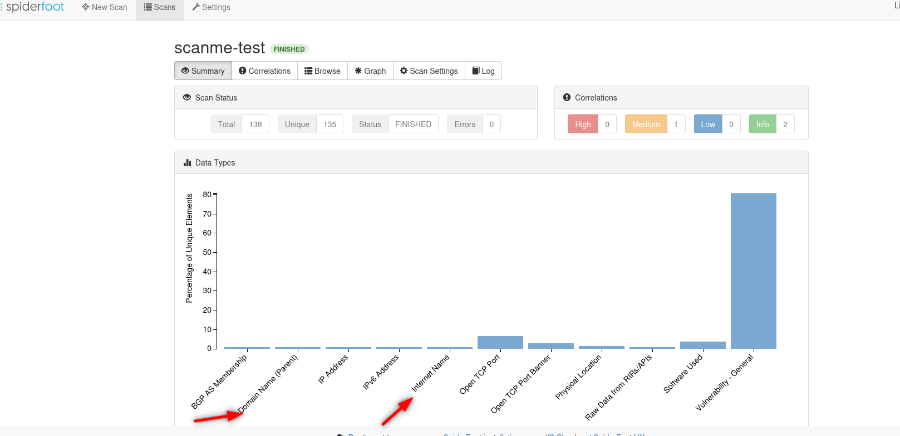

If we look at what sfp_dnsresolve watches for and produces, we see:
```
# What events is this module interested in for input
    def watchedEvents(self):
        return [
            # Events that need some kind of DNS treatment
            "CO_HOSTED_SITE", "AFFILIATE_INTERNET_NAME", "NETBLOCK_OWNER", "NETBLOCKV6_OWNER",
            "IP_ADDRESS", "IPV6_ADDRESS", "INTERNET_NAME", "AFFILIATE_IPADDR", "AFFILIATE_IPV6_ADDRESS",
            # Events that may contain hostnames in their content
            "TARGET_WEB_CONTENT", "BASE64_DATA", "AFFILIATE_DOMAIN_WHOIS",
            "CO_HOSTED_SITE_DOMAIN_WHOIS", "DOMAIN_WHOIS", "NETBLOCK_WHOIS",
            "LEAKSITE_CONTENT", "RAW_DNS_RECORDS", "RAW_FILE_META_DATA",
            "RAW_RIR_DATA", "SIMILARDOMAIN_WHOIS",
            "SSL_CERTIFICATE_RAW", "SSL_CERTIFICATE_ISSUED", "TCP_PORT_OPEN_BANNER",
            "WEBSERVER_BANNER", "WEBSERVER_HTTPHEADERS"
        ]

    # What events this module produces
    def producedEvents(self):
        return ["IP_ADDRESS", "INTERNET_NAME", "AFFILIATE_INTERNET_NAME",
                "AFFILIATE_IPADDR", "AFFILIATE_IPV6_ADDRESS", "DOMAIN_NAME", "IPV6_ADDRESS", "INTERNAL_IP_ADDRESS",
                "DOMAIN_NAME_PARENT", "CO_HOSTED_SITE_DOMAIN", "AFFILIATE_DOMAIN_NAME",
                "INTERNET_NAME_UNRESOLVED"]
```

So because INTERNET_NAME is part of its watch list, DNS Resolver fires off. 
```
sfp_dnsresolve.handleEvent(event)
```
We see that one of its producedEvents is IP_ADDRESS, and it does give me 45.33.32.156. 

```
SpiderFootEvent(
    "IP_ADDRESS",
    "93.184.216.34",
    ...
)
```
And calls
```
self.notifyListeners(evt)
```


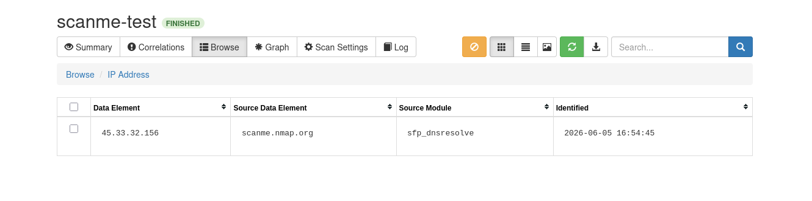

Because I had Shodan and NMAP enabled, both of those take in IP_ADDRESS on their watchlist, so they fire off. For NMAP, I see it gives Open TCP Ports, as well as Shodan:

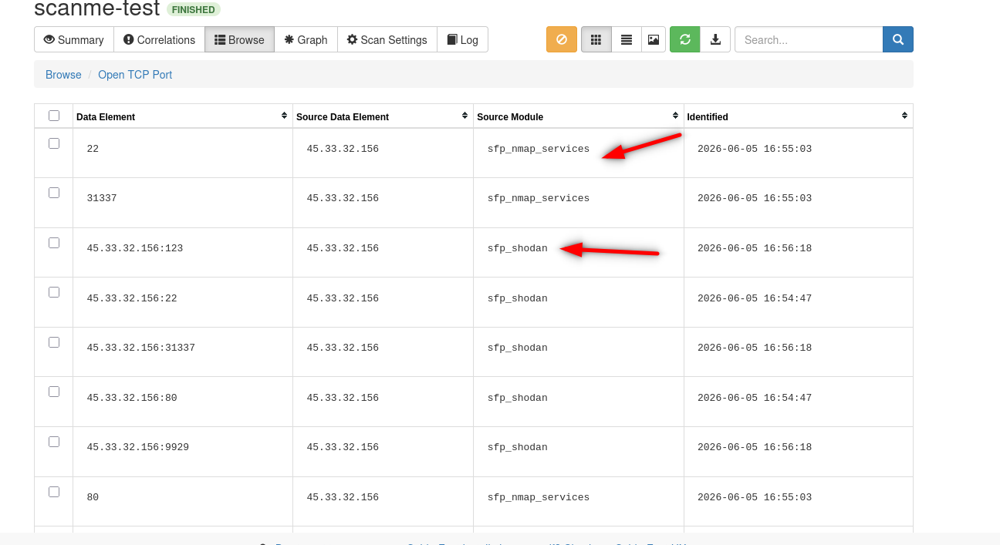

It also gives me banners, letting me know whats on that port:


Shodan and NMAP also tell me the software in use (based on the banners)

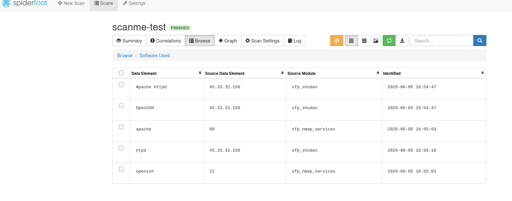

If we look in db.py, we can see that these are indeed producable events:

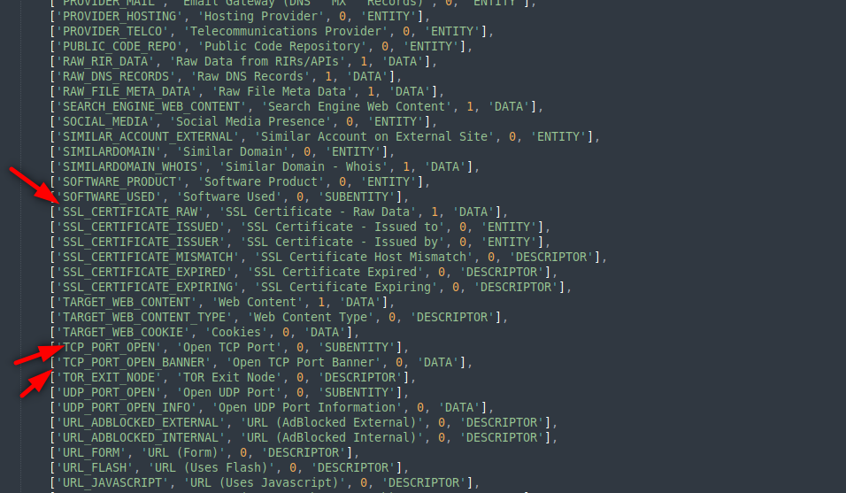

If you look at sfp_shodan.py, you will see under its producedEvents that they also produce Vulnerabiity information

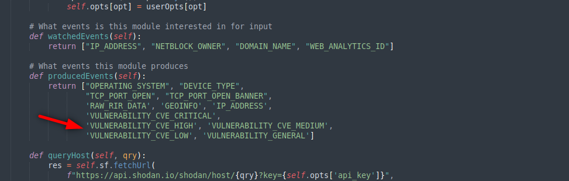

And indeed we got some back in our scan based on the software used and their versions.

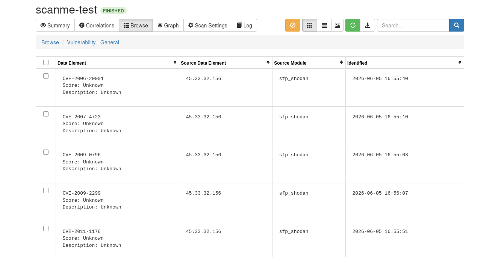

If we had enabled a CVE enrichment module, it could take in these Vulnerability produced events and fire off there. 

## Summary
So you can see how one input can end up being enriched to a ton of other data that can then pivot off and be enriched by other modules, creating a pretty full picture of what you were looking for. 

We will leave it here for the basics, but we will dive into other aspects in other tutorials.


