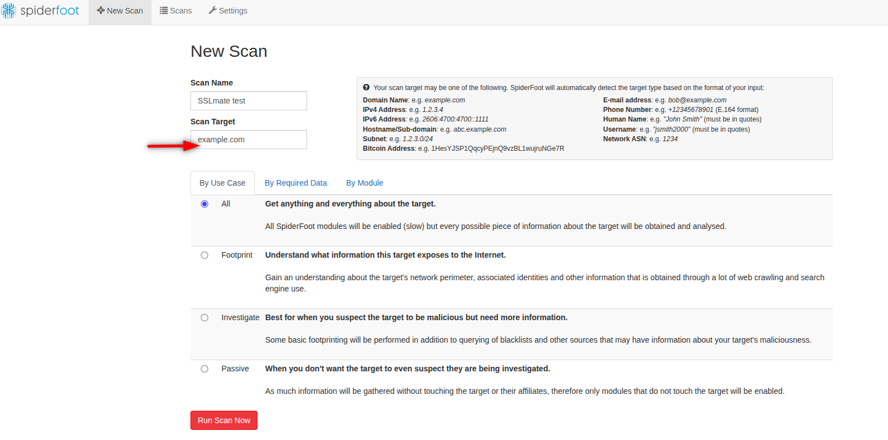
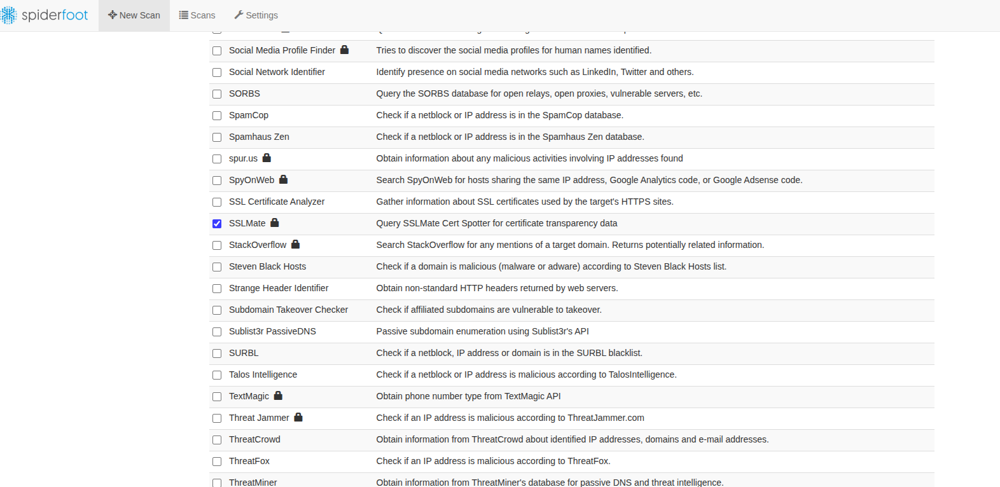
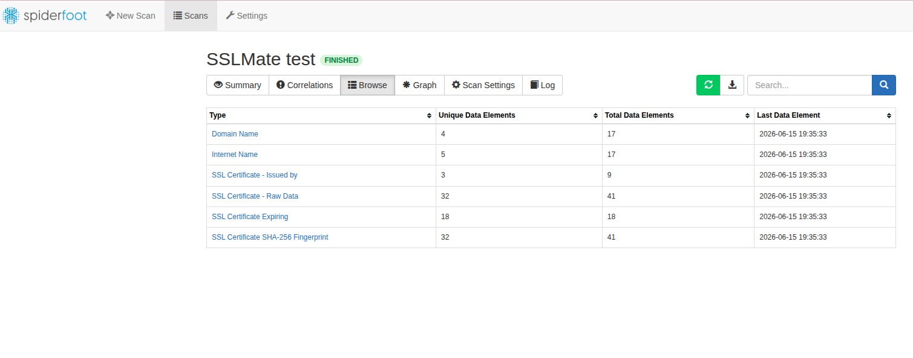
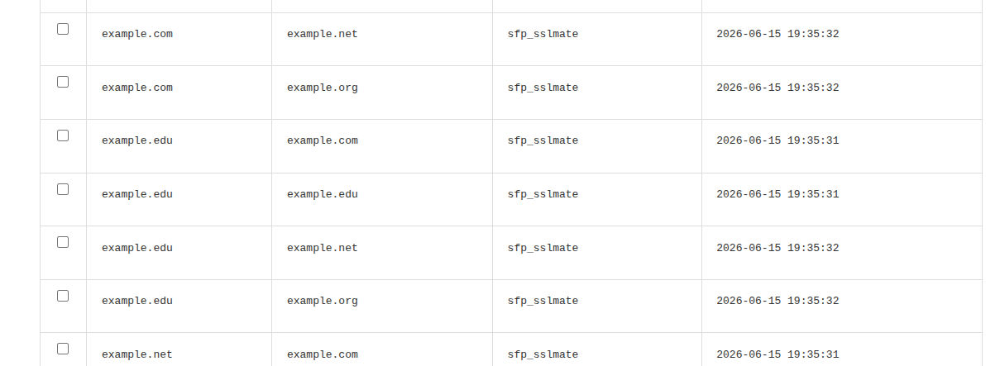
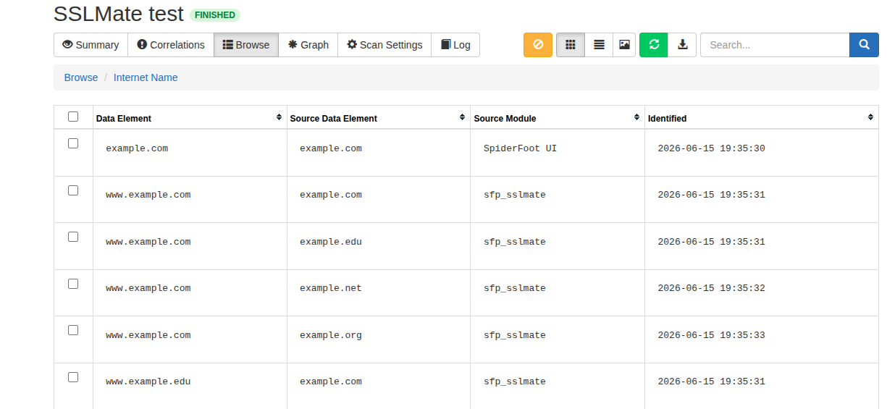
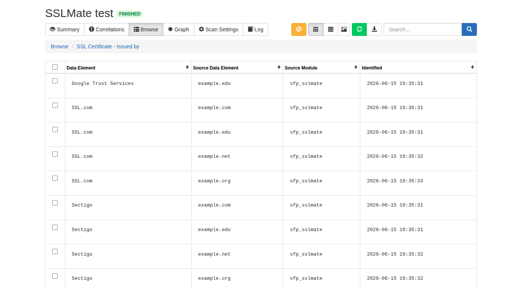
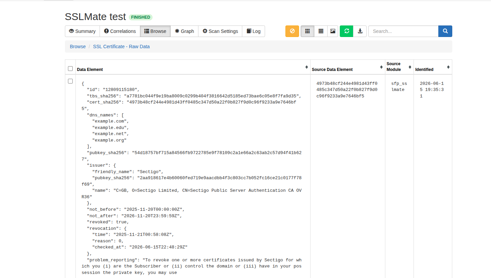
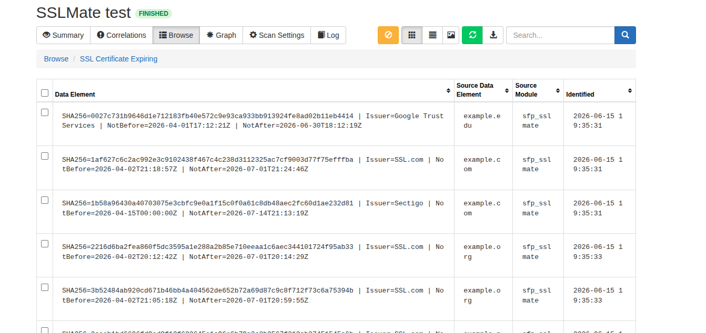
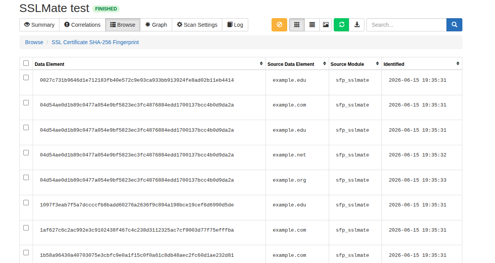

# Spiderfoot Custom Module - SSLMate

***

## Goal
I want certificate information for a domain name, but Censys free API only allows a very small amount of queries per month and CRT.sh is constantly getting 500 server errors. Another option is the SSLMate certificate Search API. So, I want to make a Spiderfoot module for this.

## API
The curl command to query the search API for a domain name is as follows:
```
curl -X GET "https://api.certspotter.com/v1/issuances?domain=example.com&expand=dns_names&expand=issuer&expand=revocation&expand=problem_reporting&expand=cert_der" -H "Authorization: Bearer <API Key>"
```
The output snippet looks like:
```
[
        {
                "id":"14215808107",
                "tbs_sha256":"c81473b523103d6b9718cf2dd9a4fe4f64d9591d7091b104801929982ffc5ac0",
                "cert_sha256":"c68ceb2ff3d93a66447a77a2b794fc61f8ecf3e8b22cec5784c2b2be6fef6f0e",
                "dns_names":[.example.com","example.com","www.example.com"],
                "pubkey_sha256":"8dad766c0ab0856689171652039024d3caf4e0a90e6ff062151b7cd853e26ea3",
                "issuer":{"friendly_name":"Let's Encrypt","pubkey_sha256":"885bf0572252c6741dc9a52f5044487fef2a93b811cdedfad7624cc283b7cdd5","name":"C=US, O=Let's Encrypt, CN=E8"},
                "not_before":"2026-03-21T14:42:02Z",
                "not_after":"2026-06-19T14:42:01Z",
```
Take note that it is an Array []. 

## New Event
The only new event I will add to DB.py is:
```
['SSL_CERTIFICATE_SHA256', 'SSL Certificate SHA-256 Fingerprint', 0, 'ENTITY'],
```
So that it can produce an event holding the SHA256 fingerprint.

## Script
Create a new script called sfp_sslmate.py
```
# -*- coding: utf-8 -*-
# -------------------------------------------------------------------------------
# Name:         sfp_sslmate
# Purpose:      Query SSLMate Cert Spotter API for certificate intelligence
#
# Licence:      MIT
# -------------------------------------------------------------------------------

import json
from datetime import datetime, timezone

from spiderfoot import SpiderFootEvent, SpiderFootPlugin


class sfp_sslmate(SpiderFootPlugin):

    meta = {
        'name': "SSLMate",
        'summary': "Query SSLMate Cert Spotter for certificate transparency data",
        'flags': ["apikey"],
        'useCases': ["Investigate", "Passive"],
        'categories': ["Search Engines"],
        'dataSource': {
            'website': "https://sslmate.com/",
            'model': "COMMERCIAL",
            'references': [
                "https://sslmate.com/certspotter/api/"
            ],
            'apiKeyInstructions': [
                "Create an SSLMate account",
                "Generate an API key",
                "Paste the API key into SpiderFoot"
            ],
            'description': "Certificate Transparency search and monitoring service."
        }
    }

    opts = {
        "api_key": "",
        "expiring_days": 30
    }

    optdescs = {
        "api_key": "SSLMate Cert Spotter API Key.",
        "expiring_days": "Number of days before expiration to generate SSL_CERTIFICATE_EXPIRING events."
    }

    results = None
    errorState = False

    def setup(self, sfc, userOpts=dict()):
        self.sf = sfc
        self.results = self.tempStorage()

        for opt in list(userOpts.keys()):
            self.opts[opt] = userOpts[opt]

    def watchedEvents(self):
        return ["DOMAIN_NAME"]

    def producedEvents(self):
        return [
            "DOMAIN_NAME",
            "INTERNET_NAME",
            "SSL_CERTIFICATE_ISSUER",
            "SSL_CERTIFICATE_SHA256",
            "SSL_CERTIFICATE_RAW",
            "SSL_CERTIFICATE_EXPIRED",
            "SSL_CERTIFICATE_EXPIRING"
        ]

    def query(self, domain):

        headers = {
            "Authorization": f"Bearer {self.opts['api_key']}"
        }

        url = (
            "https://api.certspotter.com/v1/issuances"
            f"?domain={domain}"
            "&expand=dns_names"
            "&expand=issuer"
            "&expand=revocation"
            "&expand=problem_reporting"
        )

        res = self.sf.fetchUrl(
            url,
            timeout=self.opts['_fetchtimeout'],
            useragent="SpiderFoot",
            headers=headers
        )

        if res['code'] in ["401", "403", "429"]:
            self.error(
                "SSLMate API key rejected or usage limits exceeded."
            )
            self.errorState = True
            return None

        if res['content'] is None:
            self.info(f"No SSLMate results found for {domain}")
            return None

        try:
            return json.loads(res['content'])
        except Exception as e:
            self.error(
                "Error processing SSLMate response: " + str(e)
            )
            return None

    def handleEvent(self, event):

        if self.errorState:
            return

        eventData = event.data

        self.debug(
            f"Received event {event.eventType}: {eventData}"
        )

        if not self.opts['api_key']:
            self.error(
                "You enabled sfp_sslmate but did not configure an API key."
            )
            self.errorState = True
            return

        if eventData in self.results:
            self.debug(f"Skipping {eventData}, already checked.")
            return

        self.results[eventData] = True

        certs = self.query(eventData)

        if not certs:
            return

        now = datetime.now(timezone.utc)

        seen_names = set()
        seen_hashes = set()
        seen_issuers = set()

        for cert in certs:

            cert_hash = cert.get("cert_sha256")
            hash_evt = None

            if cert_hash and cert_hash not in seen_hashes:
                seen_hashes.add(cert_hash)

                hash_evt = SpiderFootEvent(
                    "SSL_CERTIFICATE_SHA256",
                    cert_hash,
                    self.__name__,
                    event
                )
                self.notifyListeners(hash_evt)

            try:
                raw_json = json.dumps(cert, indent=2)

                raw_parent = hash_evt if hash_evt else event

                raw_evt = SpiderFootEvent(
                    "SSL_CERTIFICATE_RAW",
                    raw_json,
                    self.__name__,
                    raw_parent
                )

                self.notifyListeners(raw_evt)

            except Exception as e:
                self.debug(
                    f"Unable to serialize certificate JSON: {e}"
                )

            issuer = cert.get("issuer", {})
            issuer_name = issuer.get("friendly_name")

            if issuer_name and issuer_name not in seen_issuers:
                seen_issuers.add(issuer_name)

                evt = SpiderFootEvent(
                    "SSL_CERTIFICATE_ISSUER",
                    issuer_name,
                    self.__name__,
                    event
                )
                self.notifyListeners(evt)

            dns_names = cert.get("dns_names", [])

            for name in dns_names:

                if not name:
                    continue

                if name in seen_names:
                    continue

                seen_names.add(name)

                if name.startswith("*."):
                    continue

                root_domain = self.sf.hostDomain(
                    name,
                    self.opts['_internettlds']
                )

                if root_domain == name:

                    evt = SpiderFootEvent(
                        "DOMAIN_NAME",
                        name,
                        self.__name__,
                        event
                    )

                else:

                    evt = SpiderFootEvent(
                        "INTERNET_NAME",
                        name,
                        self.__name__,
                        event
                    )

                self.notifyListeners(evt)

            expiry = cert.get("not_after")

            if not expiry:
                continue

            try:

                expiry_dt = datetime.fromisoformat(
                    expiry.replace("Z", "+00:00")
                )

                days_remaining = (
                    expiry_dt - now
                ).total_seconds() / 86400

                issuer_name = issuer.get(
                    "friendly_name",
                    "Unknown Issuer"
                )

                event_text = (
                    f"SHA256={cert_hash} | "
                    f"Issuer={issuer_name} | "
                    f"NotBefore={cert.get('not_before')} | "
                    f"NotAfter={cert.get('not_after')}"
                )

                if expiry_dt < now:

                    evt = SpiderFootEvent(
                        "SSL_CERTIFICATE_EXPIRED",
                        event_text,
                        self.__name__,
                        event
                    )

                    self.notifyListeners(evt)

                elif days_remaining <= int(
                    self.opts["expiring_days"]
                ):

                    evt = SpiderFootEvent(
                        "SSL_CERTIFICATE_EXPIRING",
                        event_text,
                        self.__name__,
                        event
                    )

                    self.notifyListeners(evt)

            except Exception as e:
                self.debug(
                    f"Unable to parse certificate expiry date: {e}"
                )

# End of sfp_sslmate class
```
Let's break down the script:

### Imports
```
import json
from datetime import datetime, timezone

from spiderfoot import SpiderFootEvent, SpiderFootPlugin
``` 
These are the imports for the script, as it will be parsing JSON, dealing with times, and it will be a module so it needs the Spiderfoot plugin library

### Class Creation
```
class sfp_sslmate(SpiderFootPlugin):
```
This creates the class needed for the module

### Metadata
```
meta = {
        'name': "SSLMate",
        'summary': "Query SSLMate Cert Spotter for certificate transparency data",
        'flags': ["apikey"],
        'useCases': ["Investigate", "Passive"],
        'categories': ["Search Engines"],
        'dataSource': {
            'website': "https://sslmate.com/",
            'model': "COMMERCIAL",
            'references': [
                "https://sslmate.com/certspotter/api/"
            ],
            'apiKeyInstructions': [
                "Create an SSLMate account",
                "Generate an API key",
                "Paste the API key into SpiderFoot"
            ],
            'description': "Certificate Transparency search and monitoring service."
        }
    }
    
```
This is the metadata describing the module as well as setting some things like categories, Use Cases, etc.

### Options Creation
```
opts = {
        "api_key": "",
        "expiring_days": 30
    }

    optdescs = {
        "api_key": "SSLMate Cert Spotter API Key.",
        "expiring_days": "Number of days before expiration to generate SSL_CERTIFICATE_EXPIRING events."
    }
```
This is the UI options information. The opts one is creating an input box in the UI Settings for SSLMate API key. The 30 days is a value you can set to determine when the event related to certificate expiration will fire off. In this case, if the expiry date is within 30 days, it will fire off the SSL Expiry event. The opdescs is just a description of the UI options.

### UI Setup
```
def setup(self, sfc, userOpts=dict()):
        self.sf = sfc
        self.results = self.tempStorage()

        for opt in list(userOpts.keys()):
            self.opts[opt] = userOpts[opt]
```
This is a setup function for the options. Its usually the same every module.

### Watched Events
```
def watchedEvents(self):
        return ["DOMAIN_NAME"]
```
This says the event this module needs as an input is a domain name (Apex Domain). This can either be from the user putting that in as an input for the scan, or if another activated module produces a DOMAIN_NAME event during its run. These will then trigger the SSLMate module to fire off.

### Produce Events
```
def producedEvents(self):
        return [
            "DOMAIN_NAME",
            "INTERNET_NAME",
            "SSL_CERTIFICATE_ISSUER",
            "SSL_CERTIFICATE_SHA256",
            "SSL_CERTIFICATE_RAW",
            "SSL_CERTIFICATE_EXPIRED",
            "SSL_CERTIFICATE_EXPIRING"
        ]
```
These are the events this module's output will create. Domain Name is the apex domain, Internet Name is the subdomains. The rest are fields from the output. When this module runs, it can produce any or all of these, which can then be consumed by another module. 


### The Query Function
```
def query(self, domain):

        headers = {
            "Authorization": f"Bearer {self.opts['api_key']}"
        }

        url = (
            "https://api.certspotter.com/v1/issuances"
            f"?domain={domain}"
            "&expand=dns_names"
            "&expand=issuer"
            "&expand=revocation"
            "&expand=problem_reporting"
        )

        res = self.sf.fetchUrl(
            url,
            timeout=self.opts['_fetchtimeout'],
            useragent="SpiderFoot",
            headers=headers
        )

        if res['code'] in ["401", "403", "429"]:
            self.error(
                "SSLMate API key rejected or usage limits exceeded."
            )
            self.errorState = True
            return None

        if res['content'] is None:
            self.info(f"No SSLMate results found for {domain}")
            return None

        try:
            return json.loads(res['content'])
        except Exception as e:
            self.error(
                "Error processing SSLMate response: " + str(e)
            )
            return None
```
This is the part that actually talks to SSLMate. 
* def query(self, domain): This creates a function named query. When SpiderFoot finds a domain like: example.com, the code later does:
```
certs = self.query(eventData)
```
which becomes:
```
certs = self.query("trinet.com")
```
So inside the function:
```
domain
```
contains:
```
example.com
```
* Next it builds the authentication header that is required for the API:
```
headers = {
    "Authorization": f"Bearer {self.opts['api_key']}"
}
```
You will recall the opts variable contains the API key you saved in the UI. The 'f' you see here is called an f-string. Its for variable insertions. Let's say you did:
```
name = "Bob"

print(f"Hello {name}")
```
You made the variable 'name' with a value of Bob. Now any strings in your script that need that, you can reference it with {name}. The f-string makes this happen. 
* Next it builds the URL
```
url = (
    "https://api.certspotter.com/v1/issuances"
    f"?domain={domain}"
    "&expand=dns_names"
    "&expand=issuer"
    "&expand=revocation"
    "&expand=problem_reporting"
)
```
That is the URL parameters given in the SSLMate API documentation. 
* Next it makes the HTTP request:
```
res = self.sf.fetchUrl(
    url,
    timeout=self.opts['_fetchtimeout'],
    useragent="SpiderFoot",
    headers=headers
)
```
This is SpiderFoot's helper function. Instead of using Python's requests library, SpiderFoot provides:
```
self.sf.fetchUrl(...)
```
which handles the following things for you:
* timeouts
* proxies
* SSL verification
* user agents
* logging
The res variable name is just a friendly name indicating the response. 
* Next it handles the HTTP methods returned. These are things like 200 if the request was successful, 404 if the page is not found, 403 if its forbidden for you to see the page, etc. This section does if/else clauses to say "if this method is returned, do this" For example:
```
if res['code'] in ["401", "403", "429"]:
```
* 401 Unauthorized is usually a bad API Key
* 403 Forbidden is usually: Account doesn't have permission
* 429 Too Many Requests is usually: Rate limit exceeded

If any occur:
```
self.error(...)
```
prints an error in SpiderFoot. Then:
```
self.errorState = True
```
tells the module: Stop querying. This prevents hammering SSLMate with bad requests. Another example is:
```
if res['content'] is None:
```
Sometimes the request succeeds but returns nothing. If this is the case, self.info(...) logs: No SSLMate results found for example.com and then it exits. 
* Next it will parse the JSON it receives. For example, if SSLMate gives it:
```
[
    {
        "cert_sha256":"abc",
        "dns_names":[...]
    }
]
```
Computers see this as strings not a list. So then:
```
json.loads(res['content'])
```
takes:
```
"[{...}]"
```
and converts it into:
```
[
    {
        "cert_sha256":"abc",
        "dns_names":[...]
    }
]
```
Now Python can work with it.
* Next it does more error handling using something called try/except. 
```
try:
            return json.loads(res['content'])
        except Exception as e:
            self.error(
                "Error processing SSLMate response: " + str(e)
            )
            return None
```
It says try doing the json.loads of the responses content. If any errors occur, dont crash the module, rather take the debug error message and store it as the variable 'e'. Then we put in a more human understandable error description and append the actual Debug Error message to the end of it. 

So for this whole 'query' function, it doesnt produce any events, it just constructs and carries out the API query.

### Handle Events Function
This is the most important function in the whole module. If query() is the part that asks SSLMate for data, then handleEvent() is the part that turns that data into SpiderFoot events. 

* def handleEvent(self, event): SpiderFoot automatically calls this whenever it finds an event type that our module watches. Earlier we made the watchedEvents function that stated it is waiting on a DOMAIN_NAME event to appear. When it does, fire this function off. 
* Next is error event handling:
```
if self.errorState:
    return
```
Think of self.errorState as an emergency stop button. Earlier, if the API key was bad:
```
self.errorState = True
```
Then every future event immediately exits:
```
return
```
which means: Stop processing.
* Next we extract the event data:
```
eventData = event.data
```
If we kicked off the scan by sending example.com, then eventData=example.com.
* Next we do some debug logging:
```
self.debug(
    f"Received event {event.eventType}: {eventData}"
)
```
This prints "Received event DOMAIN_NAME: example.com" This is purely for debugging.
* Next we verify if the API key exists:
```
if not self.opts['api_key']:
```
If user forgot to configure the module:
```
self.error(...)
```
prints:
```
You enabled sfp_sslmate but did not configure an API key.
```
and quits.
* Next we check for duplicates:
```
if eventData in self.results:
```
Earlier we had coded:
```
self.results = self.tempStorage()
```
Suppose we've already processed:
```
example.com
```
then:
```
self.results
```
looks like:
```
{
    "trinet.com": True
}
```
If we see it again:
```
return
```
Prevents duplicate API calls.
* Then we mark it as processed:
```
self.results[eventData] = True
```
Adds:
```
{
    "trinet.com": True
}
```
to the cache.
* Next we query SSLMate
```
certs = self.query(eventData)
```
Again, think of eventData as being 'example.com'. 
* What if there are no results?
```
if not certs:
    return
```
If SSLMate returned:
```
None
```
or:
```
[]
```
Then stop processing.
* Next we check the current time:
```
now = datetime.now(timezone.utc)
```
Gets:
```
Current UTC time
```
Used later for expiration checks. Example: 2026-06-15 21:00 UTC
* next we create tracking sets:
```
seen_names = set()
seen_hashes = set()
seen_issuers = set()
```
A set is like a list that automatically prevents duplicates. As an example:
```
seen_names.add("www.trinet.com")
seen_names.add("www.trinet.com")
```
Gives the result:
```
{"www.trinet.com"}
```
Only once. 
* Next we process each certificate:
```
for cert in certs:
```
Suppose SSLMate returned:
```
[
  {...cert1...},
  {...cert2...},
  {...cert3...}
]
```
This loops through them one at a time.
* Next we get the SHA256 hash:
```
cert_hash = cert.get("cert_sha256")
```
* Then we emit the SHA256 event:
```
hash_evt = SpiderFootEvent(
    "SSL_CERTIFICATE_SHA256",
    cert_hash,
    self.__name__,
    event
)
```
This is using the Spiderfoot plugin import we did at the top of the script to create an event, putting the value of cert_hash in the Event SSL_CERTIFICATE_SHA256.
* Then we send the event:
```
self.notifyListeners(hash_evt)
```
If there are other activated modules in the scan that have in their watchedEvents list SSL_CERTIFICATE_SHA256, then they want to know that the SSLMate module produced that event. This notifies all listening. 
* Next we make the raw JSON for the RAW event type:
```
raw_json = json.dumps(cert, indent=2)
```
This converts the Python object into JSON readable text.
* next we make the parent event logic:
```
raw_parent = hash_evt if hash_evt else event
```
This means: If SHA256 event exists, attach RAW data to it. Otherwise attach to original domain.
* Next we create the RAW data event:
```
raw_evt = SpiderFootEvent(
    "SSL_CERTIFICATE_RAW",
    raw_json,
    self.__name__,
    raw_parent
)
```
This stuffs the values of what the previous command did(converting Python objects into JSON) into the Event type SSL_CERTIFICATE_RAW. Now that event will contain the full JSON raw data.
* Next we get the Cert Issuer data:
```
issuer = cert.get("issuer", {})
```
This takes the JSON of 
```
{
    "friendly_name":"Let's Encrypt"
}
```
Converts it to a Python object
```
issuer_name = issuer.get("friendly_name")
```
And the value now becomes:
```
Let's Encrypt
```
Same steps above to create the Issuer event.
* Next we get the DNS Names section:
```
dns_names = cert.get("dns_names", [])
```
Because its an array, it gets:
```
[
  "trinet.com",
  "www.trinet.com",
  "rubiks.trinet.com"
]
```
Loop:
```
for name in dns_names:
```
processes each one.
* Next we configure to ignore wildcards:
```
if name.startswith("*."):
    continue
```
That would skip:
```
*.trinet.com
```
Because its a wildcard. 
* Next we want to determine the root domain (Apex Domain)
```
root_domain = self.sf.hostDomain(
    name,
    self.opts['_internettlds']
)
```
If we have
```
www.trinet.com
```
This section of code makes it:
```
trinet.com
```
* Then it does an if/else, basically saying if:
```
root_domain == name
```
Where name is trinet.com, then create:
```
DOMAIN_NAME
```
Otherwise create:
```
INTERNET_NAME
```
Which corresponds with subdomains like www
* Next we get expiration data:
```
expiry = cert.get("not_after")
```
So this would take someting like:
```
2026-06-19T14:42:01Z
```
And convert string into datetime:
```
expiry_dt = datetime.fromisoformat(
    expiry.replace("Z", "+00:00")
)
```
Now Python can do date math.
* Next we calculate the days remaining:
```
days_remaining = (
    expiry_dt - now
).total_seconds() / 86400
```
Remember in our opts UI settings we had 30 days as a default expiry. 
* Next we create readable text:
```
event_text = (
    f"SHA256={cert_hash} | "
    f"Issuer={issuer_name} | "
    f"NotBefore={cert.get('not_before')} | "
    f"NotAfter={cert.get('not_after')}"
)
```
Which produces:
```
SHA256=c68ceb...
Issuer=Let's Encrypt
NotBefore=2026-03-21...
NotAfter=2026-06-19...
```
* What if its expired?
```
if expiry_dt < now:
```
Then create the event:
```
SSL_CERTIFICATE_EXPIRED
```
* What if its not expired but it is expiring soon (within 30 days)?
```
elif days_remaining <= int(
    self.opts["expiring_days"]
):
```
We already know in our UI the expiring_days = 30. If its within this window, then create the event:
```
SSL_CERTIFICATE_EXPIRING
```

## Demo
So let's take this thing for a test run. First we setup a New Scan and we will use example.com



Then we set the module as the only module to run:



After running we go to the Browse tab and see the results:



Here is the Domain Name one (Apex Domains):



Here is the Internet Name ones (subdomains):



Now the certificate Issued by:



Here is the Raw JSON Data"



This one shows SSL Certs Expiring. As this document was done in mid-June, we see the ones that expire within 30 days:



Then we have the SHA256 hashes of the various Certificates:



It does deduplicate values and gives Unique Elements as well, which is what can be passed to an AI summarizer later on. You can see that just the single module being run can produce a good amount of data. Couple that with other modules for IPs and Domains and you will get a more complete view with pivots. 


